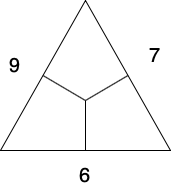
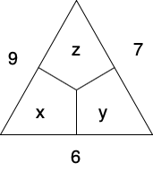

# Home schooling

In the past few weeks all around the world a lot of parents had the double burden of working full time and in addition as well teach their kids who have to stay at home due to the COVID-19 pandemic. My family is not exception here, but I think we managed reasonably well and were not to bad off.

My son is a first grade pupil. This means his main task is to learn to read and write. On the math side he learns how to add and subtract whole numbers in the range from zero to twenty and something about symmetry and reading the clock. I am very happy about the progress he has made while I was his only teacher. 

## From first grade to university math in 15 minutes

One of the math problems of my son I have found quiet intriguing. The problem was as follows. Consider the following triangle.

Each empty space has to be filled with a whole numbers such that sum of two numbers lying side by side  is equal to the whole number written next to the 
side.

At first site I did not see the solution. I was surprised since this is "merely" a math problem of a first grader. What will happen in the future to me? 

So I set out to solve the problem not in the first grader way but with a bit more advanced mathematics. My first step was to introduce variables. This has let me to the following triangle

Using it I could read off the following set of linear equations

$$
x + y = 6 \\
y + z = 7 \\
x + z = 9 \\
$$

This part could still be understood by my son. The set of equations can be easily solved (not yet by him) and I could have continued with my life but somehow I thought we could push the boundaries even further. Reformulating the above set of equations as a matrix equation leads one to 

$$
\begin{pmatrix}
1 & 1 & 0\\
0 & 1 & 1\\
1 & 0 & 1\\    
\end{pmatrix}
\begin{pmatrix}
x\\
y\\
z\\    
\end{pmatrix}
=
\begin{pmatrix}
6\\
7\\
9\\    
\end{pmatrix}
$$

Let's call the matrix above A. Then the inverse of it is given by 

$$
A^{-1}
=
\frac{1}{2}
\begin{pmatrix}
1 & -1 & 1\\
1 & 1 & -1\\
-1 & 1 & 1\\    
\end{pmatrix}
$$

Using this inverse matrix we can now easily generate new examples of triangle problems of this kinds because the underlying set of equations only changes with respect to the right hand side of the above matrix equation, i.e. the sum values in the triangle.

### Takeaways

Here are for me a few takeaways:

- A simple first grade math problem -- or any type of problem -- can easily get very fast arbitrarily complicated. This can reach the point of on-going research.
- Already first grade students can be introduced to the concepts of equations and even sets of linear equations. I personally think that one could easily speed up most of the curriculum and adopt it to the need and speed of each and every student. This unfortunately can not be accomplished by a teacher who has to look after more than twenty students.