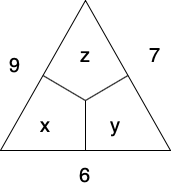

# Home schooling

In the past few weeks all around the world a lot of parents have had or have the double burden of working full time and in addition teach their kids from home. For most of us this combination is very uncommon 
and not an easy task. My family is not exception here, but I think we managed the situation reasonably well.

My son is a first grade pupil. This means he has learn to read and write. On the math side he learns how to add and subtract whole numbers in the range from zero to twenty and something about symmetry and reading the clock. I am very happy about the progress he has made while I was more or less his only teacher. We are very grateful to his real teach to supply us with enough material and some guidance from the distance.

## From first grade to university math in 15 minutes

In this post I want to put some emphasis on the math side since this is near and dear to my heart. One of the math problems of my son I have found quiet intriguing. The problem was as follows. Consider the following triangle.

Each empty space has to be filled with a whole numbers such that sum of two numbers lying side by side  is equal to the whole number written next to the side.

At first site I did not see the solution. I was surprised since this is "merely" a math problem of a first grader. What will happen in the future to me? 

So I set out to solve the problem not in the first grader way but with a bit more advanced mathematics. My first step was to introduce variables. This has let me to the following triangle

Using it I could read off the following set of linear equations

$$
x + y = 6 \\
y + z = 7 \\
x + z = 9 \\
$$

This part could still be understood by my son. The set of equations can be easily solved (not yet by him) and I could have continued with my life but somehow I thought we could push the boundaries even further. Reformulating the above set of equations as a matrix equation leads one to 

$$
\begin{pmatrix}
1 & 1 & 0\\
0 & 1 & 1\\
1 & 0 & 1\\    
\end{pmatrix}
\begin{pmatrix}
x\\
y\\
z\\    
\end{pmatrix}
=
\begin{pmatrix}
6\\
7\\
9\\    
\end{pmatrix}
$$

Let's call the matrix above A. Then the inverse of it is given by 

$$
A^{-1}
=
\frac{1}{2}
\begin{pmatrix}
1 & -1 & 1\\
1 & 1 & -1\\
-1 & 1 & 1\\    
\end{pmatrix}
$$

Applying this from the right-hand side to the above matrix equation one finds the solution: $x=4$, $y=2$ and $z=5$.

Using the (inverse) matrix we can now easily generate new examples for the triangle problem and find their solutions. This is because the underlying set of equations only changes with respect to the right hand side of the matrix equation, i.e. the sum values in the triangle. For example using the right-hand side $b^{T} = (15, 13, 18)^{T}$ it is now easy to find the solution. Now it is even easier than it actually turned out to be in the first case. Note, that one can not choose the right-hand side arbitrarily since the calculations here don't take into account that the summands need to be whole numbers. 

If you're to lazy to do the calculations by yourself you can as well have a look a this [Jupyter notebook](http://mybinder.org/v2/gh/dressedfez/first-grade-math-problem/master?filepath=Simple_math_first_grade.ipynb).

### Takeaways

Here are for me a few takeaways:

- A simple first grade math problem -- or any type of problem -- can easily get very fast arbitrarily complicated. This can reach the point of present-day research.
- Already first grade students can be introduced to the concepts of equations and even sets of linear equations. I personally think that one could easily speed up most of the curriculum and adopt it to the need and speed of each and every student. This unfortunately can not be accomplished by a teacher who has to look after more than twenty students.
- I have realized that I very much enjoy teaching various subjects to people.